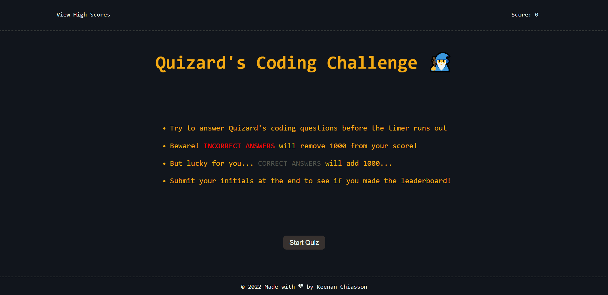
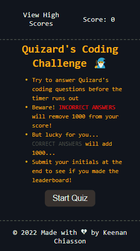

# 🧙‍♂️ Quizard's Coding Challenge

Will you enter the Quizard's coding gauntlet?

Prove you have what it takes to climb to the top of the leaderboard among the few...

...or perish into obscurity among the many...

...your destiny awaits you.

## 📖 Description
Description

## 📚 Table of Contents
- [🧙‍♂️ Quizard's Coding Challenge](#️-quizards-coding-challenge)
  - [📖 Description](#-description)
  - [📚 Table of Contents](#-table-of-contents)
  - [🧾 Features](#-features)
  - [💯 Additional Features](#-additional-features)
  - [🛠️ Installation](#️-installation)
  - [👨‍🏫 Usage](#-usage)
  - [🥂 Credits](#-credits)
  - [📇 License](#-license)
  - [👋 How to Contribute](#-how-to-contribute)

## 🧾 Features
- A timed quiz on JavaScript fundamentals
- Stores high scores
- Upon starting, the user is presented with a question
- Additional questions are presented as user answers them
- Incorrect answers subtract time from the clock
- Quiz ends when all questions are answered or timer reaches 0
- User can submit initials and save their score after quiz

## 💯 Additional Features
- Placeholder values in high score table on first visit
- High scores must be between 1 and 3 characters and will always render as uppercase letters
- Input is forced
- Correct answers add time to the clock
- Incorrect answers turn the score counter red for a brief moment
- Correct answers turn the score counter green for a brief moment
- Styling for both desktop and mobile users
- Input automatically focused after quiz end
- User highlighting prevented for better experience
- 'Try again' option at quiz end provides incentive for user to stay on site
- Negative score values converted to 0
- localStorage only stores top scores to prevent bloat

## 🛠️ Installation
Locate the dropdown menu labeled 'Code' to the left of the About section in the main page of this repository. From there, select your preferred cloning method from HTTPS, SSH, or the GitHub CLI. For this demonstration, we will be using the SSH method. Copy the link and head to your terminal. From the command line you should enter:

    git clone <INSERT_SSH_KEY_HERE>

Replacing the above placeholder with the link copied from GitHub. This will clone the repository into a local directory on your machine. And that's it! Happy Hacking! 🚀

## 👨‍🏫 Usage
This code is strictly for use in the International Coding Quizard's Gauntlet of Sorcerers and Sorcery 🧙‍♂️ and is only provided as material for study and otherwise double-checking implementation of various javascript and Web API functionality. Any violations of these use cases will see the offender flogged in the streets, held in the stocks for a brief period, and sent to a life in the cells of the black dungeon shortly thereafter. Screenshots of original mockup are included.

   

Mobile-responsive version

**Supports most major touchscreen devices**

  

## 🥂 Credits
UT Austin Coding Boot Camp https://techbootcamps.utexas.edu/coding/

Kyle Ferguson https://github.com/kferguson52

Stack Overflow https://stackoverflow.com/

W3 Schools https://www.w3schools.com/

MDN Web Docs https://developer.mozilla.org/en-US/

Michael Karén https://michael-karen.medium.com/how-to-save-high-scores-in-local-storage-7860baca9d68

## 📇 License
MIT License

Copyright (c) 2021 Keenan R. Chiasson

Permission is hereby granted, free of charge, to any person obtaining a copy
of this software and associated documentation files (the "Software"), to deal
in the Software without restriction, including without limitation the rights
to use, copy, modify, merge, publish, distribute, sublicense, and/or sell
copies of the Software, and to permit persons to whom the Software is
furnished to do so, subject to the following conditions:

The above copyright notice and this permission notice shall be included in all
copies or substantial portions of the Software.

THE SOFTWARE IS PROVIDED "AS IS", WITHOUT WARRANTY OF ANY KIND, EXPRESS OR
IMPLIED, INCLUDING BUT NOT LIMITED TO THE WARRANTIES OF MERCHANTABILITY,
FITNESS FOR A PARTICULAR PURPOSE AND NONINFRINGEMENT. IN NO EVENT SHALL THE
AUTHORS OR COPYRIGHT HOLDERS BE LIABLE FOR ANY CLAIM, DAMAGES OR OTHER
LIABILITY, WHETHER IN AN ACTION OF CONTRACT, TORT OR OTHERWISE, ARISING FROM,
OUT OF OR IN CONNECTION WITH THE SOFTWARE OR THE USE OR OTHER DEALINGS IN THE
SOFTWARE.

## 👋 How to Contribute

See the [Contributor Covenant](https://www.contributor-covenant.org/) for details on how to contribute
